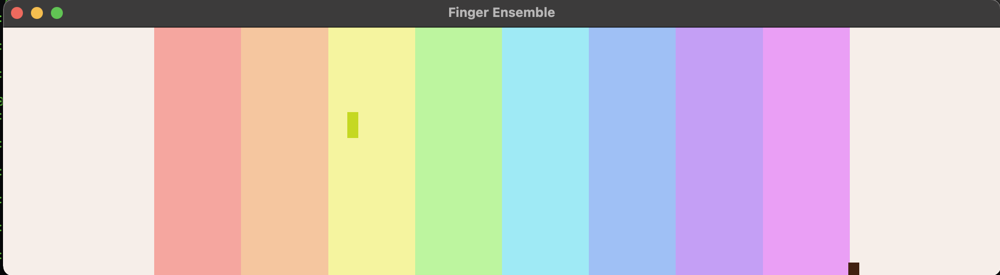

# Finger Ensemble

Author: Katherine Wang

Design: Each player who joins has 1 finger and can play a sound on the piano. As more players join, together they can create more interesting melodies.

Networking: 
The messages that the clients send over are of the form "b(space.downs)(position.x)(position.y)" where 'b' is just a character indicating the start of our message, space.downs is the number of times the player pressed the space bar, and position.x and position.y are floats which describe where the player's cursor is in the space. So for each message, the client sends over 10 bytes. The client->server message sending code is in PlayMode.cpp on lines 183-186.

The server takes in that message and updates its knowledge of the player's cursor location, and also notes the number of times space was pressed. It checks if the space bar was pressed in a region where a key is, and then sends back information regarding which key was pressed (there are 8 keys total). The server sends the same message back to each client of the form "(position.x, position.y)<color.r, color.g, color.b, color.a>(...)<...>......k(key_id)(key_id)....". That is, first the server sends over all the cursor positions and colors of all known players, followed by a character k. After k are the numbers 0-7 which indicate which of the 8 keys were played by any players. All of this server->client message sending code is in server.cpp on lines 124-196. 

This message is sent over as a string and then parsed by the client in PlayMode.cpp on lines 222-271.

Screen Shot:

How To Play:

Move your mouse to move your cursor/finger. Press the space bar to play the note you are hovering over on the piano.

Sources: 
Random number generator code inspiration: https://stackoverflow.com/questions/686353/random-float-number-generation
pop.wav: https://freesound.org/people/Juaner_/sounds/471441/
chirp.wav: https://freesound.org/people/basedMedia/sounds/548096/
boop.wav: https://freesound.org/people/lcscrts/sounds/576319/
quack.wav: https://freesound.org/people/Gamezger/sounds/398088/
drum.wav: https://freesound.org/people/tripjazz/sounds/508559/
squeak.wav: https://freesound.org/people/Higgs01/sounds/428114/
bop.wav: https://freesound.org/people/Leszek_Szary/sounds/146717/
bark.wav: https://freesound.org/people/SGAK/sounds/467840/

This game was built with [NEST](NEST.md).

